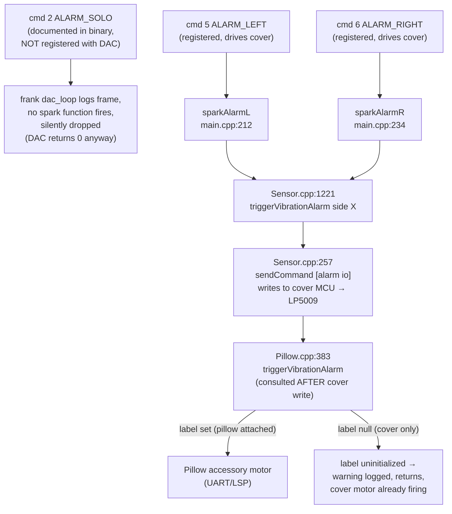

# Alarm system

How a user-configured alarm becomes a buzz on the cover. Covers the three
documented firmware alarm opcodes, which of them actually fires the
cover motor on Pod 5 J55 firmware, the CBOR wire format, and the live
diagnosis technique. The original "use solo" decision in
[ADR 0021](../adr/0021-alarm-solo-trigger.md) was wrong and is now
superseded — see that ADR's "Correction" section and the
[Reality check](#reality-check-pod-5-j55-firmware) below.

## End-to-end flow

```mermaid
flowchart LR
    UI["AlarmEditor / AlarmSection"]
    Trpc["device.setAlarm tRPC mutation"]
    Sched["jobManager (cron)"]
    Client["sharedClient.ts<br/>HardwareClient.setAlarm()"]
    Encode["alarmPayload.ts<br/>encodeAlarmPayload()"]
    Dac["dacTransport<br/>sendCommand()"]
    Sock["/persistent/deviceinfo/dac.sock"]
    Frank["frankenfirmware"]
    LP5009L["LP5009 left<br/>(cover motor driver)"]
    LP5009R["LP5009 right<br/>(cover motor driver)"]

    UI -->|"Test button"| Trpc
    Sched -->|"scheduled fire"| Client
    Trpc --> Client
    Client --> Encode
    Encode -->|"hex-CBOR string"| Dac
    Dac -->|"{cmd}\n{arg}\n\n"| Sock
    Sock --> Frank
    Frank -->|"sparkAlarmL / triggerVibrationAlarm<br/>(side: 'left')"| LP5009L
    Frank -->|"sparkAlarmR / triggerVibrationAlarm<br/>(side: 'right')"| LP5009R
```



The UI calls `device.setAlarm` for immediate tests; the scheduler calls
`setAlarm()` directly when an `alarm_schedules` row fires. Both end up at
the same hardware client, with the same per-side opcode (`ALARM_LEFT`
cmd 5 or `ALARM_RIGHT` cmd 6).

## The documented alarm opcodes

frankenfirmware's binary references three alarm-related code paths. Same
wire format on all three; the command code selects the path. Live
behavior on Pod 5 J55 firmware:



### Reality check: Pod 5 J55 firmware

- **`ALARM_SOLO` (cmd 17) is not a usable cover-motor path.** The strings
  `sparkAlarmS`, `[alarm] vib. solo`, `setHighCurrentVibration`,
  `enabling Pod 2.0 vibration (simultaneous motors)` are present in the
  binary, and cmd 17 reaches `sparkAlarmS`, but live probing shows it
  immediately clears both alarm channels without an `[alarm io] ... start`
  motor write. It also does not enter the center-button haptic confirm path.
- **`ALARM_LEFT` / `ALARM_RIGHT` (cmd 5 / 6) fire the cover motor on
  cover-only pods.** The pillow label gate (`Pillow.cpp:383`) only
  affects the separate pillow-accessory motor; it runs AFTER the cover
  motor write (`Sensor.cpp:1221 triggerVibrationAlarm` →
  `Sensor.cpp:257 [alarm io] side N power P pattern X for D`). The
  "label uninitialized or does not support vibration" log line that
  appears in cover-only setups is cosmetic from the alarm system's
  point of view — the cover has already been told to vibrate.

**Routing:** `HardwareClient.setAlarm()` uses `ALARM_LEFT` (cmd 5) for
`side: 'left'` and `ALARM_RIGHT` (cmd 6) for `side: 'right'`, both with
the hex-CBOR payload from `encodeAlarmPayload()`. Per-side independence
is real.

## Hidden center-confirm haptic command

The exact center-button confirmation buzz is **not** a DAC alarm command. Live
binary analysis and Sensor USART probing on Pod 5 J55 firmware found a hidden
Sensor command used by the native haptic path:

| Field | Value for exact confirm | Meaning |
|-------|--------------------------|---------|
| opcode | `0x40` | Hidden Sensor haptic command |
| side | `0x00` left, `0x01` right | Cover side |
| power | `0x19` (`25`) | Same power as center double-click |
| pattern | `0x07` | Same firmware haptic pattern as center double-click |
| pulse count | `0x02` | Two quick pulses; firmware expands this to 750ms |

The command uses the normal Sensor/Frozen USART frame wrapper: `0x7E`, payload
length, payload bytes, CRC16-CCITT (`0x1D0F` seed) over the payload. Exact frames:

```text
left:  payload 40 00 19 07 02 → frame 7e 05 40 00 19 07 02 84 81
right: payload 40 01 19 07 02 → frame 7e 05 40 01 19 07 02 f2 35
```

Live proof:

```text
FW: ... alarm[left] haptic mode--dur 2->750
FW: ... alarm[left] start: power 25, pattern 7, dur 750 ms
```

This is now the cover-button feedback path (`src/hardware/sensorHaptics.ts`).
It writes one short frame to `/dev/ttyS2` without changing tty settings, while
frankenfirmware remains the Sensor owner/reader. Normal wake alarms still use
`ALARM_LEFT` / `ALARM_RIGHT`; this hidden command is only for fast confirmation
haptics.

**Retrigger behavior:** the Sensor MCU ignores a second same-side haptic command
while the 750ms confirm is still running. SleepyPod queues same-side feedback
for the next available slot (~760ms after the previous start) so quick top then
bottom actions get deterministic confirmation instead of a silently dropped
second buzz. Opposite sides are independent and can fire immediately.

## CBOR payload

Every alarm command takes a single string argument: the hex encoding of a
CBOR-serialized map. Four Particle-Spark-style short keys.

| Key  | Type   | Range / format        | Meaning                                                                              |
|------|--------|-----------------------|--------------------------------------------------------------------------------------|
| `pl` | uint   | 1–100                 | Power level (intensity %). Hardware-enforced; >100 rejected at parse. **No perceived effect on Pod 5 J55** — see [Empirical behavior](#empirical-behavior-pl-and-pi). |
| `du` | uint   | 10–180 (seconds)      | Duration. Firmware silently ignores values below 10s — the motor won't engage. We clamp client-side. **Only field with a user-meaningful effect** on Pod 5 J55. |
| `pi` | string | `"rise"` \| `"double"`| Vibration pattern. `rise` is documented as soft→strong ramp, `double` as two firm bursts — but both feel identical on Pod 5 J55. See [Empirical behavior](#empirical-behavior-pl-and-pi). |
| `tt` | uint   | unix epoch seconds    | Trigger time. Firmware uses it for retry windows and dismiss correlation.            |

### Empirical behavior: `pl` and `pi`

Live tested on Pod 5 J55 (192.168.1.88) — 2026-05-12:

- **`pl` (intensity) has no perceptible effect.** `pl=1` and `pl=100`
  produce indistinguishable buzz. frank logs echo the correct power
  value, so the truncation happens downstream in the cover MCU (the
  separate firmware blob that drives the LP5009). The MCU appears to
  run a fixed motor envelope regardless of the power argument.
- **`pi='rise'` and `pi='double'` feel the same.** Both patterns
  produce the same buzz profile. The firmware log line
  `Sensor.cpp:257 [alarm io] … pattern X` echoes the value, but the
  cover MCU does not appear to switch envelope shapes.
- **Net: `du` (duration) is the only user-meaningful field.** The UI
  exposes intensity and pattern controls, but they are cosmetic on the
  current firmware. Document this in any user-facing setting and
  consider hiding or disabling the controls until firmware behavior
  is confirmed on other pod versions.

Reverse-engineering the cover MCU envelope tables is a separate effort
— frank doesn't have visibility into it.

Encoding (`src/hardware/alarmPayload.ts`):

```typescript
const encoder = new Encoder({ useRecords: false })

export function encodeAlarmPayload(config: AlarmConfig): string {
  const payload = {
    pl: config.vibrationIntensity,
    du: Math.max(10, config.duration),
    pi: config.vibrationPattern,
    tt: Math.floor(Date.now() / 1000),
  }
  return Buffer.from(encoder.encode(payload)).toString('hex')
}
```

### Worked example

`config = { vibrationIntensity: 60, vibrationPattern: 'rise', duration: 15 }` at
unix time `1778486725` encodes to:

```text
b9000462706c183c6264750f62706964726973656274741a6a018d52
```

Decoded byte-by-byte:

| Bytes           | CBOR meaning              |
|-----------------|---------------------------|
| `b9 0004`       | map with 4 entries        |
| `62 70 6c`      | text(2) = `"pl"`          |
| `18 3c`         | uint(0x3c) = 60           |
| `62 64 75`      | text(2) = `"du"`          |
| `0f`            | uint(15)                  |
| `62 70 69`      | text(2) = `"pi"`          |
| `64 72697365`   | text(4) = `"rise"`        |
| `62 74 74`      | text(2) = `"tt"`          |
| `1a 6a018d52`   | uint(0x6a018d52) = epoch  |

### Earlier (broken) format

The original implementation sent a comma string —
`"{intensity},{patternCode},{duration}"` where `patternCode` was `'0'` or
`'1'`. The firmware's registered function (`SensorAlarm.h::
trySparkParseAlarmSettings`) rejected this with:

```text
ERR SensorAlarm.h:39 trySparkParseAlarmSettings|alarm settings args: 80,0,10
WRN device_api_client.cpp:26 receive|receive: 5 registered-function returned err:-1
```

The CBOR map is what the firmware (and the official 8 Sleep cloud) expects.

## Wire framing

The DAC socket is a Unix stream socket at
`/persistent/deviceinfo/dac.sock`. Frames are text:

```text
{command-code}\n{argument}\n\n
```

`\n\n` is the message delimiter. The argument is the hex-CBOR string for
alarm commands, a plain integer for temperature setpoints, etc. See
`docs/hardware/DAC-PROTOCOL.md` for the full command table.

## Clearing the alarm

The `ALARM_CLEAR` command (cmd `16`) takes a single character argument:
`'0'` = clear left, `'1'` = clear right. It works regardless of which
opcode started the alarm (firmware's clear path doesn't consult pillow
labels). `device.clearAlarm` uses this directly; `snoozeAlarm` clears,
schedules a setTimeout, and re-sends the same alarm config when the
timer fires (`src/hardware/snoozeManager.ts`).

**Cover-motor startup race:** the cover MCU needs a non-trivial time to
ramp the LP5009 from a clear state to motor-running. Sending
`ALARM_CLEAR` within ~100ms of `ALARM_LEFT`/`RIGHT` cancels the buzz
before the user feels it (verified live — `alarm[left] start` log line
appears, but the next line is `alarm[left] off` from the clear). Probe
scripts must let the buzz run before clearing.

## Diagnosing "API returns success but no buzz"

The DAC response code is unreliable — frank returns `0` for any opcode
without a registered spark function, masking a silent drop. The ground
truth is in `journalctl -u frank` on the pod. The full chain on a
working cover-motor write looks like:

```text
dac_loop command: 5 payload: b9...
[alarm] vib. left: time …, power …, pattern double, dur …
Sensor.cpp:1221 triggerVibrationAlarm side left
Sensor.cpp:257 sendCommand [alarm io] side 0 power … pattern … for …
Pillow.cpp:383 left label uninitialized or does not support vibration   ← cosmetic, ignore
Sensor.cpp:614 [sensor] -> FW: … alarm[left] start: power … dur … ms
```

If `sparkAlarmL` / `sparkAlarmR` (or `triggerVibrationAlarm`) does not
appear after `dac_loop command: N`, the opcode has no registered
handler. If `alarm[left] start` appears followed quickly by
`alarm[left] off`, a clear races the start.

## Why two layers of motor drivers?

The cover has two **LP5009** chips — one per side — that drive both LEDs
and the vibration motor on that side. Physical center-button haptic feedback
is generated locally by the cover MCU writing to the LP5009. The hidden Sensor
`0x40` command above lets the pod request that same haptic envelope directly.
The alarm path is separate: the pod tells the cover MCU "vibrate now" through
`ALARM_LEFT` / `ALARM_RIGHT`, and the cover MCU writes the alarm envelope to its
local LP5009.

The Pillow accessory has its own MCU and its own motor on a separate
UART link. The firmware's `Pillow.cpp` path is what drives it. The cover
motors are accessible via `ALARM_LEFT`/`ALARM_RIGHT` (cmd 5/6) — the
pillow code path runs after the cover write and is a no-op on cover-only
pods (a warning logs but the cover motor has already started).

## Files

- `src/hardware/alarmPayload.ts` — `encodeAlarmPayload()` (single source of truth)
- `src/hardware/sensorHaptics.ts` — hidden Sensor `0x40` center-confirm haptic
  frame and same-side retrigger queue
- `src/hardware/sharedClient.ts` — production write path (`getSharedHardwareClient`)
- `src/hardware/client.ts` — dev/test write path
- `src/hardware/types.ts` — `HardwareCommand.ALARM_LEFT/RIGHT/CLEAR` (the
  enum's `ALARM_SOLO` entry maps to cmd 17 but is not a usable cover-motor path
  on the current firmware — see [Reality check](#reality-check-pod-5-j55-firmware))
- `src/server/routers/device.ts` — `setAlarm` / `clearAlarm` / `snoozeAlarm` tRPC procedures + `execute` raw passthrough
- `src/scheduler/jobManager.ts` — fires scheduled `alarm_schedules` rows
- `src/components/Schedule/AlarmEditor.tsx` — UI Test button + persistence

## Open work

- Confirm `ALARM_LEFT` / `ALARM_RIGHT` cover-motor write works on Pod 3
  and Pod 4 firmware (verified on Pod 5 J55 only).
- Confirm hidden Sensor opcode `0x40` on Pod 3 / Pod 4 firmware before enabling
  exact confirm haptics on those generations.

## Rejected DAC paths for center-confirm haptics

The center-button double-click confirm buzz is not an alarm pattern. On Pod 5
J55, a physical center double-tap logs:

```text
[TTC] processing [button] side left { button: middle, type: short, count: 2 }
[buttons] sent button event s0x00 i0x01 c0x02
alarm[left] haptic mode--dur 2->750
alarm[left] start: power 25, pattern 7, dur 750 ms
```

The DAC command surface cannot currently trigger that path:

- `ALARM_LEFT` / `ALARM_RIGHT` with normal CBOR payloads route through alarm
  parsing and enforce the 10s alarm duration floor.
- Raw `ALARM_LEFT` payloads with `du: 2` and `pi` values `double`, `rise`,
  `testdrive`, or `luna` log `sparkAlarmL` and then `alarm[left] off`; they do
  not enter haptic mode.
- Raw `pi: "haptic"` and `pi: "7"` are rejected by `parseAlarmPattern`; raw
  numeric `pi: 7` does not produce the center haptic path.
- `ALARM_SOLO` / cmd 17 reaches `sparkAlarmS`, but clears both alarm channels
  without an `[alarm io] ... start` write.

SleepyPod Core therefore bypasses the DAC alarm command surface for cover-button
feedback and writes the hidden Sensor `0x40` frame documented above.
